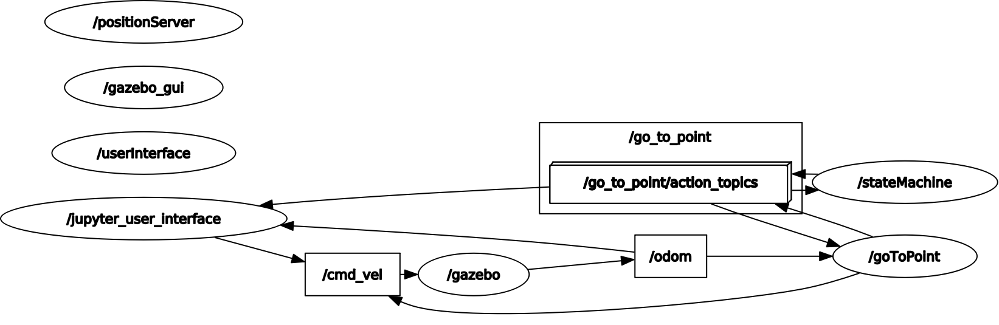

# First Assignment of the Research Track 2 course (Robotics Engineering / JEMARO, Unige)
The package contains the nodes and the simulation environment for controlling a mobile robot in the Gazebo simulation environment.

## Table of contents
* [Requirements](#requirements)
* [General info](#general-info)
* [Description of the system](#description-of-the-system)
* [Codes and nodes](#codes-and-nodes) 
* [Coppelia scene](#coppelia-scene)
* [Running the code](#running-the-code) 
* [Futher information](#futher-information)

## Requirements

To properly oberserve and run correctly the behaviour of the mobile robot in your machine, it's necessary to have in your linux system:
- Ubuntu 20.04 
- ROS Noetic
- ROS2 Foxy
- Python3
- Gazebo
- Jupyter notebook 

## General info

This package is responsible to control a mobile robot when receives a `go_to_point` command from the user.

## Description of the system

The launch file will open and start:
1. The simulation environment
2. The node `random_position_server`, which implements a random position service
3. The node `go_to_point`, which implements a service to drive a robot toward a point in the environment
4. The node `state_machine`, which implements a service to start or stop the robot, and calls the other two services to drive the robot
5. The node `jupyter_user_interface`, which asks the user to start/stop the robot, and calls the service implemented in the state_machine node
6. The service implemented in the `go_to_point` node is able to drive the robot towards a certain position in space (x, y) and with a certain angle (theta)
7. The service implemented in the `random_position_server` node replies with random values for x, y, and theta, where x and y should be limited between some min and max values
8. The service implemented in the robot `state_machine` node gives the possibility to start or stop the robot behaviour.

Because our user request is implemented as an action, it can be preempted, this way we can stop the robot at any time during the simulation and then restart it with a new goal.



## Codes e nodes

In this package, at the scripts folder, it's possible to find 2 '.py' extension files, each one with it's own node:

- **go_to_point.py:** A action server that controls the robot speed depending on random generated goal;
- **jupyter_user_interface.py:** A node that sends the request to *start* or *stop* the *go_to_point node*

In this package, at the src folder, it's possible to find 2 '.cpp' extension files, each one with it's own node:

- **position_service.cpp:** It generates a random position for x, y and theta when requested.
- **state_machine.cpp:** Send a *new* goal/objective to the *go_to_point* actoin server

## Coppelia scene

- RobotnikScene.ttt: A Coppelia scene containing a robot interacting with the simulation. The mobile robot used in this assignment was the Robotnik Summit XL140701 without obstacles in the environment.

## Running the code

To compile, first it is necessary to source your ROS version.
```
source ros.sh
roscore &
jupyter notebook --allow-root --ip 0.0.0.0
```

### Launching the UDF mobile robot

- **sim.launch:** Contain all the nodes necessary to launch the simulation, the Gazebo environment will start automaticaly
```
roslaunch rt2_assignment1 sim.launch
```

### Launching the Coppelia mobile robot

Don't forget to start the CoppeliaSim in parallel with your ros.sh correctly sourced and the 'play' button pressed.

- **Robotnik_coppelia_scene.launch:** Contain all the nodes necessary to launch the simulation, the Gazebo environment will start automaticaly
```
roslaunch rt2_assignment1 Robotnik_coppelia_scene.launch
```

## Futher information

To have acess to the documentation of this project, you need to go to:
- folder `_build`
- folder `html`
- double click on the file `index.html`
